# تصميم نظام عبّ الآن - وثيقة البنية المعمارية

## نظرة عامة على النظام

نظام متكامل لتقسيط وقود السيارات يتكون من ثلاث خدمات مصغرة (Microservices):
1. **خدمة الفوترة (Billing Service)** - إدارة الفواتير والتقسيط
2. **خدمة الرحلات (Journey Service)** - تخطيط المسارات ومحطات الوقود
3. **محرك سنافي AI (Snafi AI Service)** - تحليل استهلاك الوقود بالذكاء الاصطناعي

---

## تصميم قاعدة البيانات (Database Schema Design)

### مخطط العلاقات (Entity Relationship Diagram)


---

### تفاصيل الجداول

#### 1. جدول المستخدمين (USERS)

| العمود | النوع | الوصف |
|--------|------|-------|
| id | UUID | المعرف الفريد |
| name | VARCHAR(100) | الاسم الكامل |
| email | VARCHAR(255) | البريد الإلكتروني (فريد) |
| phone | VARCHAR(20) | رقم الجوال (فريد) |
| national_id | VARCHAR(20) | رقم الهوية الوطنية |
| password_hash | VARCHAR(255) | كلمة المرور المشفرة |
| status | ENUM | (active, suspended, pending) |
| credit_limit | DECIMAL(10,2) | الحد الائتماني |
| credit_score | DECIMAL(5,2) | درجة الائتمان (0-100) |
| created_at | TIMESTAMP | تاريخ الإنشاء |
| updated_at | TIMESTAMP | تاريخ التحديث |

#### 2. جدول المحفظة (WALLETS)

| العمود | النوع | الوصف |
|--------|------|-------|
| id | UUID | المعرف الفريد |
| user_id | UUID | معرف المستخدم |
| balance | DECIMAL(12,2) | الرصيد الحالي |
| available_credit | DECIMAL(12,2) | الائتمان المتاح |
| used_credit | DECIMAL(12,2) | الائتمان المستخدم |
| currency | ENUM | (SAR, USD) |
| is_active | BOOLEAN | حالة المحفظة |

#### 3. جدول الفواتير (INVOICES)

| العمود | النوع | الوصف |
|--------|------|-------|
| id | UUID | المعرف الفريد |
| user_id | UUID | معرف المستخدم |
| vehicle_id | UUID | معرف المركبة |
| station_id | UUID | معرف المحطة |
| snafi_approval_id | UUID | معرف موافقة سنافي |
| fuel_type | ENUM | (91, 95, diesel) |
| liters | DECIMAL(8,2) | كمية اللترات |
| price_per_liter | DECIMAL(6,2) | سعر اللتر |
| total_amount | DECIMAL(10,2) | المبلغ الإجمالي |
| total_installments | INTEGER | عدد الأقساط |
| paid_installments | INTEGER | الأقساط المسددة |
| monthly_amount | DECIMAL(10,2) | القسط الشهري |
| status | ENUM | (pending, active, completed, overdue) |

#### 4. جدول موافقات سنافي (SNAFI_APPROVALS)

| العمود | النوع | الوصف |
|--------|------|-------|
| id | UUID | المعرف الفريد |
| user_id | UUID | معرف المستخدم |
| vehicle_id | UUID | معرف المركبة |
| requested_amount | DECIMAL(10,2) | المبلغ المطلوب |
| approved_amount | DECIMAL(10,2) | المبلغ الموافق عليه |
| risk_score | DECIMAL(5,2) | درجة المخاطرة |
| decision | ENUM | (approved, rejected, pending) |
| reason | TEXT | سبب القرار |
| ai_analysis | JSON | تحليل الذكاء الاصطناعي |

---

## مخططات تسلسل العمليات (Sequence Diagrams)

### 1. رحلة طلب تعبئة الوقود وإصدار فاتورة التقسيط

```mermaid
sequenceDiagram
    autonumber
    participant C as العميل
    participant APP as تطبيق عبّ الآن
    participant BS as خدمة الفوترة
    participant SNAFI as محرك سنافي AI
    participant W as المحفظة
    participant S as محطة الوقود
    participant DB as قاعدة البيانات

    Note over C,DB: مرحلة طلب التعبئة

    C->>APP: فتح التطبيق
    APP->>DB: جلب بيانات المستخدم والمركبة
    DB-->>APP: بيانات المستخدم
    APP-->>C: عرض الصفحة الرئيسية

    C->>APP: طلب تعبئة وقود (50 لتر، بنزين 95)
    APP->>SNAFI: طلب تقييم الائتمان
    
    Note over SNAFI: تحليل الذكاء الاصطناعي

    SNAFI->>DB: جلب سجل المستخدم والمدفوعات
    DB-->>SNAFI: البيانات التاريخية
    SNAFI->>SNAFI: حساب درجة المخاطرة
    SNAFI->>SNAFI: تحليل نمط الاستهلاك
    SNAFI->>SNAFI: التحقق من الحد الائتماني
    
    alt الموافقة على الطلب
        SNAFI-->>APP: موافقة (risk_score < 30%)
        APP->>DB: حفظ موافقة سنافي
        
        Note over C,DB: مرحلة إنشاء الفاتورة

        APP->>BS: إنشاء فاتورة تقسيط
        BS->>DB: حفظ الفاتورة
        BS->>W: خصم من الائتمان المتاح
        W->>DB: تحديث المحفظة
        BS-->>APP: تأكيد إنشاء الفاتورة
        
        APP->>S: إرسال كود التعبئة
        APP-->>C: عرض كود التعبئة وتفاصيل الفاتورة
        
        C->>S: التوجه للمحطة وعرض الكود
        S->>APP: تأكيد استلام الوقود
        APP->>DB: تحديث حالة الفاتورة إلى "نشطة"
        APP-->>C: إشعار نجاح العملية
        
    else رفض الطلب
        SNAFI-->>APP: رفض (risk_score >= 30%)
        APP-->>C: عرض سبب الرفض واقتراحات
    end
```

### 2. رحلة سداد القسط الشهري

```mermaid
sequenceDiagram
    autonumber
    participant C as العميل
    participant APP as تطبيق عبّ الآن
    participant BS as خدمة الفوترة
    participant W as المحفظة
    participant PG as بوابة الدفع
    participant DB as قاعدة البيانات
    participant N as خدمة الإشعارات

    Note over C,N: إشعار موعد السداد

    N->>C: إشعار: موعد سداد القسط (قبل 3 أيام)
    C->>APP: فتح صفحة الفواتير
    APP->>BS: جلب الفواتير النشطة
    BS->>DB: استعلام الفواتير
    DB-->>BS: قائمة الفواتير
    BS-->>APP: عرض الفواتير

    C->>APP: اختيار فاتورة للسداد
    APP-->>C: عرض تفاصيل القسط

    C->>APP: تأكيد السداد
    APP->>PG: طلب الدفع
    
    alt نجاح الدفع
        PG-->>APP: تأكيد الدفع (transaction_ref)
        APP->>BS: تسجيل السداد
        BS->>DB: إنشاء سجل الدفع
        BS->>W: تحديث الائتمان المتاح
        W->>DB: تحديث المحفظة
        BS->>DB: تحديث الفاتورة (paid_installments++)
        
        alt جميع الأقساط مسددة
            BS->>DB: تحديث حالة الفاتورة إلى "مكتملة"
            N->>C: إشعار: تم إغلاق الفاتورة بنجاح
        else أقساط متبقية
            N->>C: إشعار: تم السداد، الأقساط المتبقية X
        end
        
        APP-->>C: عرض إيصال الدفع
        
    else فشل الدفع
        PG-->>APP: فشل الدفع (السبب)
        APP-->>C: عرض رسالة الخطأ
    end
```

### 3. رحلة تخطيط مسار وحساب الوقود

```mermaid
sequenceDiagram
    autonumber
    participant C as العميل
    participant APP as تطبيق عبّ الآن
    participant JS as خدمة الرحلات
    participant SNAFI as محرك سنافي AI
    participant DB as قاعدة البيانات
    participant MAPS as خدمة الخرائط

    C->>APP: فتح صفحة "صمم رحلتك"
    APP->>JS: جلب الرحلات السابقة
    JS->>DB: استعلام الرحلات
    DB-->>JS: الرحلات المحفوظة
    JS-->>APP: عرض الرحلات

    C->>APP: إنشاء رحلة جديدة
    C->>APP: إدخال نقطة البداية (الرياض)
    C->>APP: إدخال نقطة النهاية (جدة)
    
    APP->>MAPS: حساب المسار والمسافة
    MAPS-->>APP: المسار (950 كم)
    
    APP->>SNAFI: حساب استهلاك الوقود
    SNAFI->>DB: جلب بيانات المركبة
    DB-->>SNAFI: سعة الخزان، متوسط الاستهلاك
    SNAFI->>SNAFI: حساب الوقود المطلوب
    SNAFI-->>APP: الوقود: 76 لتر، التكلفة: 165 ريال
    
    APP->>JS: جلب المحطات على المسار
    JS->>DB: استعلام المحطات
    DB-->>JS: قائمة المحطات
    JS-->>APP: المحطات المتاحة
    
    APP-->>C: عرض الخريطة والمحطات والتكلفة
    
    C->>APP: اختيار محطات التوقف
    C->>APP: حفظ الرحلة
    
    APP->>JS: حفظ خطة الرحلة
    JS->>DB: إنشاء سجل الرحلة
    DB-->>JS: تأكيد الحفظ
    JS-->>APP: الرحلة محفوظة
    APP-->>C: عرض تفاصيل الرحلة المحفوظة
```

### 4. رحلة قياس مستوى الخزان وتحليل سنافي

```mermaid
sequenceDiagram
    autonumber
    participant C as العميل
    participant APP as تطبيق عبّ الآن
    participant SNAFI as محرك سنافي AI
    participant CLAUDE as Claude AI
    participant DB as قاعدة البيانات
    participant N as خدمة الإشعارات

    C->>APP: فتح صفحة "محرك سنافي"
    APP->>SNAFI: جلب آخر القراءات
    SNAFI->>DB: استعلام القراءات
    DB-->>SNAFI: القراءات السابقة
    SNAFI-->>APP: عرض الإحصائيات

    C->>APP: إضافة قراءة جديدة
    C->>APP: إدخال البيانات (الخزان: 60 لتر، الحالي: 25 لتر)
    
    APP->>SNAFI: تسجيل القراءة
    SNAFI->>SNAFI: حساب نسبة الامتلاء (41.7%)
    SNAFI->>SNAFI: حساب المسافة المتوقعة (312 كم)
    
    SNAFI->>CLAUDE: طلب تحليل وتوصية
    Note over CLAUDE: تحليل بالذكاء الاصطناعي
    CLAUDE->>CLAUDE: تحليل نمط الاستهلاك
    CLAUDE->>CLAUDE: مقارنة بالقراءات السابقة
    CLAUDE->>CLAUDE: توليد توصية مخصصة
    CLAUDE-->>SNAFI: التوصية: "مستوى الوقود معتدل..."
    
    SNAFI->>DB: حفظ القراءة والتوصية
    SNAFI-->>APP: القراءة والتوصية
    APP-->>C: عرض التحليل والتوصية
    
    alt مستوى الوقود منخفض (<20%)
        SNAFI->>SNAFI: إنشاء تنبؤ عاجل
        SNAFI->>DB: حفظ التنبؤ
        N->>C: تنبيه: مستوى الوقود منخفض!
    end
```

---

## بنية الخدمات المصغرة (Microservices Architecture)

```mermaid
flowchart TB
    subgraph CLIENT["العميل"]
        WEB[تطبيق الويب]
        MOBILE[تطبيق الجوال]
    end

    subgraph GATEWAY["بوابة API"]
        AG[API Gateway]
        AUTH[المصادقة JWT]
    end

    subgraph SERVICES["الخدمات المصغرة"]
        BS[خدمة الفوترة<br/>:3001]
        JS[خدمة الرحلات<br/>:3002]
        SNAFI[محرك سنافي<br/>:3003]
    end

    subgraph EXTERNAL["الخدمات الخارجية"]
        CLAUDE[Claude AI]
        PG[بوابة الدفع]
        MAPS[خدمة الخرائط]
    end

    subgraph DATA["طبقة البيانات"]
        POSTGRES[(PostgreSQL)]
        REDIS[(Redis Cache)]
    end

    WEB --> AG
    MOBILE --> AG
    AG --> AUTH
    AUTH --> BS
    AUTH --> JS
    AUTH --> SNAFI
    
    BS --> POSTGRES
    JS --> POSTGRES
    SNAFI --> POSTGRES
    
    BS --> REDIS
    JS --> REDIS
    SNAFI --> REDIS
    
    SNAFI --> CLAUDE
    BS --> PG
    JS --> MAPS
```

---

## نموذج البيانات المشتركة (Shared Data Models)

### حالات الفاتورة (Invoice Status Flow)

```mermaid
stateDiagram-v2
    [*] --> pending: طلب جديد
    pending --> approved: موافقة سنافي
    pending --> rejected: رفض سنافي
    approved --> active: استلام الوقود
    active --> active: سداد جزئي
    active --> completed: سداد كامل
    active --> overdue: تأخر السداد
    overdue --> active: سداد المتأخر
    overdue --> suspended: إيقاف الحساب
    completed --> [*]
    rejected --> [*]
```

### حالات موافقة سنافي (Snafi Approval Flow)

```mermaid
stateDiagram-v2
    [*] --> analyzing: استلام الطلب
    analyzing --> risk_assessment: تحليل البيانات
    risk_assessment --> approved: risk < 30%
    risk_assessment --> review: 30% <= risk < 50%
    risk_assessment --> rejected: risk >= 50%
    review --> approved: مراجعة يدوية
    review --> rejected: رفض المراجعة
    approved --> [*]
    rejected --> [*]
```

---

## ملاحظات التنفيذ

### الأمان
- جميع كلمات المرور مشفرة باستخدام bcrypt
- المصادقة عبر JWT tokens
- تشفير البيانات الحساسة في قاعدة البيانات
- Rate limiting على جميع نقاط API

### الأداء
- استخدام Redis للتخزين المؤقت
- فهرسة الجداول على الحقول المستخدمة بكثرة
- Pagination لجميع القوائم
- Lazy loading للبيانات الثقيلة

### التوسع
- كل خدمة مصغرة مستقلة ويمكن توسيعها أفقياً
- قاعدة بيانات مشتركة مع إمكانية الفصل لاحقاً
- Message Queue للعمليات الطويلة (مستقبلاً)

---

---

## كتالوج السيارات الذكي

### جدول كتالوج السيارات (VEHICLE_CATALOG)
قاعدة بيانات شاملة لأكثر من 60 سيارة من أشهر الماركات في السوق السعودي.

| العمود | النوع | الوصف |
|--------|------|-------|
| id | UUID | المعرف الفريد |
| make | VARCHAR | الشركة المصنعة (إنجليزي) |
| make_ar | VARCHAR | الشركة المصنعة (عربي) |
| model | VARCHAR | الموديل (إنجليزي) |
| model_ar | VARCHAR | الموديل (عربي) |
| year_from | INTEGER | سنة البداية |
| year_to | INTEGER | سنة النهاية |
| tank_capacity | DECIMAL | سعة الخزان (لتر) |
| fuel_type | ENUM | نوع الوقود (91/95/diesel) |
| avg_consumption | DECIMAL | متوسط الاستهلاك (لتر/100كم) |
| popularity | INTEGER | ترتيب الشعبية |
| category | ENUM | الفئة (sedan/suv/pickup/hatchback) |
| is_active | BOOLEAN | نشط |

**الشركات المدعومة:** تويوتا، هيونداي، كيا، نيسان، هوندا، فورد، مازدا، شيفروليه، جي إم سي، ميتسوبيشي، لكزس، إنفينيتي، جيب

---

## نظام التحقق والامتثال (KYC/AML)

### جدول التحقق من نفاذ (NAFATH_VERIFICATIONS)

| العمود | النوع | الوصف |
|--------|------|-------|
| id | UUID | المعرف الفريد |
| user_id | UUID | معرف المستخدم |
| national_id | VARCHAR | رقم الهوية الوطنية |
| request_id | VARCHAR | معرف طلب نفاذ |
| random_number | VARCHAR | الرقم العشوائي للتحقق |
| status | ENUM | الحالة (pending/verified/failed) |
| verified_name | VARCHAR | الاسم المتحقق منه |
| date_of_birth | DATE | تاريخ الميلاد |
| gender | ENUM | الجنس |

### جدول فحص الامتثال (COMPLIANCE_CHECKS)

| العمود | النوع | الوصف |
|--------|------|-------|
| id | UUID | المعرف الفريد |
| user_id | UUID | معرف المستخدم |
| check_type | ENUM | نوع الفحص (kyc/aml/sanctions) |
| is_passed | BOOLEAN | اجتاز الفحص |
| risk_level | ENUM | مستوى المخاطر (low/medium/high) |
| pep_status | BOOLEAN | شخصية سياسية بارزة |
| sanctions_match | BOOLEAN | مطابقة قوائم العقوبات |
| wanted_list_match | BOOLEAN | مطابقة قوائم المطلوبين |

### جدول السجل الائتماني - سمة (CREDIT_REPORTS)

| العمود | النوع | الوصف |
|--------|------|-------|
| id | UUID | المعرف الفريد |
| user_id | UUID | معرف المستخدم |
| simah_score | INTEGER | نقاط سمة (300-900) |
| total_debts | DECIMAL | إجمالي الديون |
| active_loans | INTEGER | القروض النشطة |
| delayed_payments | INTEGER | المدفوعات المتأخرة |
| defaulted_loans | INTEGER | القروض المتعثرة |
| risk_category | ENUM | فئة المخاطر |
| recommended_limit | DECIMAL | الحد الائتماني الموصى |

### جدول بيانات التوظيف - GOSI (EMPLOYMENT_RECORDS)

| العمود | النوع | الوصف |
|--------|------|-------|
| id | UUID | المعرف الفريد |
| user_id | UUID | معرف المستخدم |
| employer_name | VARCHAR | اسم جهة العمل |
| employer_type | ENUM | نوع الجهة (government/semi_gov/private) |
| job_title | VARCHAR | المسمى الوظيفي |
| monthly_salary | DECIMAL | الراتب الشهري |
| gosi_registered | BOOLEAN | مسجل في التأمينات الاجتماعية |

### جدول تقييم العميل الشامل (CUSTOMER_RATINGS)

| العمود | النوع | الوصف |
|--------|------|-------|
| id | UUID | المعرف الفريد |
| user_id | UUID | معرف المستخدم (فريد) |
| overall_score | INTEGER | النقاط الإجمالية (0-100) |
| nafath_verified | BOOLEAN | تم التحقق من نفاذ |
| kyc_passed | BOOLEAN | اجتاز KYC |
| credit_approved | BOOLEAN | موافقة ائتمانية |
| priority_level | ENUM | مستوى الأولوية |
| recommended_credit_limit | DECIMAL | الحد الائتماني الموصى |
| max_installment_months | INTEGER | أقصى مدة تقسيط |

---

## محرك سنافي لدعم القرار الذكي

### جدول سجلات التعبئة (REFUELING_HISTORY)

| العمود | النوع | الوصف |
|--------|------|-------|
| id | UUID | المعرف الفريد |
| user_id | UUID | معرف المستخدم |
| vehicle_id | UUID | معرف السيارة |
| fuel_type | ENUM | نوع الوقود |
| fuel_level_before | DECIMAL | نسبة الوقود قبل التعبئة |
| fuel_level_after | DECIMAL | نسبة الوقود بعد التعبئة |
| liters_added | DECIMAL | اللترات المضافة |
| price_per_liter | DECIMAL | سعر اللتر |
| total_cost | DECIMAL | التكلفة الإجمالية |
| was_successful | BOOLEAN | تعبئة ناجحة |
| user_satisfaction | INTEGER | تقييم المستخدم (1-5) |

### جدول جلسات دعم القرار (DECISION_SUPPORT_SESSIONS)

| العمود | النوع | الوصف |
|--------|------|-------|
| id | UUID | المعرف الفريد |
| decision_support_id | VARCHAR | معرف القرار (SNAFI-DSS-XXXXXX) |
| user_id | UUID | معرف المستخدم |
| vehicle_make | VARCHAR | الشركة المصنعة |
| vehicle_model | VARCHAR | الموديل |
| tank_capacity | DECIMAL | سعة الخزان |
| current_fuel_percentage | DECIMAL | نسبة الوقود الحالية |
| fuel_type | ENUM | نوع الوقود |
| recommended_liters | DECIMAL | اللترات الموصى بها |
| estimated_cost | DECIMAL | التكلفة المتوقعة |
| confidence_score | DECIMAL | نسبة الثقة (0-100) |
| matched_records | INTEGER | السجلات المطابقة |
| session_status | ENUM | حالة الجلسة |
| actual_liters | DECIMAL | اللترات الفعلية |
| prediction_accuracy | DECIMAL | دقة التنبؤ |

### جدول أسعار الوقود (FUEL_PRICES)

| العمود | النوع | الوصف |
|--------|------|-------|
| id | UUID | المعرف الفريد |
| fuel_type | ENUM | نوع الوقود (91/95/diesel) |
| price_per_liter | DECIMAL | السعر لكل لتر |
| effective_from | TIMESTAMP | تاريخ السريان |
| is_current | BOOLEAN | السعر الحالي |

**الأسعار الافتراضية (ريال سعودي):**
- بنزين 91: 2.18 ريال/لتر
- بنزين 95: 2.33 ريال/لتر
- ديزل: 0.52 ريال/لتر

---

## خوارزمية توصية سنافي

```mermaid
flowchart TD
    A[استلام بيانات السيارة] --> B[قراءة مستوى الوقود الحالي]
    B --> C[البحث في السجلات التاريخية]
    C --> D{سجلات مطابقة؟}
    D -->|نعم| E[حساب المتوسط المرجح]
    D -->|لا| F[استخدام القيم الافتراضية]
    E --> G[حساب نسبة الثقة]
    F --> G
    G --> H[توليد التوصية]
    H --> I[حساب التكلفة المتوقعة]
    I --> J[تقديم البدائل]
    J --> K[عرض التوصية للمستخدم]
```

### معادلة حساب الثقة:
```
الثقة = min(95, 50 + (عدد السجلات × 3) + (معدل النجاح × 0.2))
```

---

## مستويات الأولوية والائتمان

| المستوى | نوع التوظيف | الحد الائتماني | مدة التقسيط |
|---------|------------|----------------|-------------|
| Premium | حكومي | 5,000 ريال | 12 شهر |
| High | شبه حكومي | 3,000 ريال | 9 أشهر |
| Medium | قطاع خاص | 2,000 ريال | 6 أشهر |
| Low | غير موظف | 500 ريال | 3 أشهر |

---

## درجات الائتمان (SIMAH)

| النطاق | التقييم | القرار | الحد الائتماني |
|--------|---------|--------|----------------|
| 750+ | ممتاز | موافقة كاملة | 100% |
| 650-749 | جيد | موافقة | 75% |
| 550-649 | مقبول | موافقة محدودة | 50% |
| 500-549 | ضعيف | مراجعة | 25% |
| <500 | مرفوض | رفض | 0% |

---

---

## هندسة قواعد بيانات سنافي (العقل المدبر)

### مخطط القواعد الأربع وعلاقاتها

```mermaid
erDiagram
    VEHICLE_CATALOG ||--o{ DECISION_SUPPORT_SESSIONS : "يوفر بيانات"
    REFUELING_HISTORY ||--o{ DECISION_SUPPORT_SESSIONS : "يطابق تاريخياً"
    DECISION_SUPPORT_SESSIONS ||--o| INVOICES : "يربط مالياً"
    DECISION_SUPPORT_SESSIONS ||--o{ PREDICTION_ACCURACY : "يقيم الدقة"
    FUEL_PRICES ||--o{ DECISION_SUPPORT_SESSIONS : "يحدد السعر"
    
    VEHICLE_CATALOG {
        uuid id PK "المعرف الفريد"
        string make "الشركة المصنعة"
        string make_ar "الشركة بالعربية"
        string model "الموديل"
        string model_ar "الموديل بالعربية"
        int year_from "سنة البداية"
        int year_to "سنة النهاية"
        decimal tank_capacity "سعة الخزان (لتر)"
        enum fuel_type "نوع الوقود"
        decimal avg_consumption "متوسط الاستهلاك"
        int popularity "ترتيب الشعبية"
        enum category "الفئة"
    }
    
    DECISION_SUPPORT_SESSIONS {
        uuid id PK "المعرف الفريد"
        string decision_support_id UK "SNAFI-DSS-XXXXXX"
        uuid user_id FK "معرف المستخدم"
        uuid vehicle_id FK "معرف السيارة"
        uuid invoice_id FK "رقم الفاتورة المربوطة"
        decimal input_fuel_percentage "نسبة الوقود الحالية"
        decimal input_tank_capacity "سعة الخزان"
        enum selected_fuel_type "نوع الوقود"
        decimal recommended_liters "اللترات الموصى بها"
        decimal estimated_cost "التكلفة المتوقعة"
        decimal confidence_score "نسبة الثقة"
        int matched_records "السجلات المطابقة"
        decimal current_fuel_price "سعر اللتر الحالي"
        enum status "حالة الجلسة"
        decimal actual_liters_used "اللترات الفعلية"
        decimal prediction_accuracy "دقة التنبؤ"
    }
    
    REFUELING_HISTORY {
        uuid id PK "المعرف الفريد"
        uuid user_id FK "معرف المستخدم"
        uuid vehicle_id FK "معرف السيارة"
        decimal fuel_level_before "نسبة قبل التعبئة"
        decimal fuel_level_after "نسبة بعد التعبئة"
        decimal liters_added "اللترات المضافة"
        decimal price_per_liter "سعر اللتر"
        decimal total_cost "التكلفة الإجمالية"
        boolean was_successful "تعبئة ناجحة"
        int user_satisfaction "تقييم 1-5"
    }
    
    INVOICES {
        uuid id PK "المعرف الفريد"
        string invoice_number UK "رقم الفاتورة"
        uuid user_id FK "معرف المستخدم"
        decimal total_amount "المبلغ الإجمالي"
        int installment_months "عدد الأقساط"
        decimal monthly_amount "القسط الشهري"
        enum status "حالة الفاتورة"
    }
    
    PREDICTION_ACCURACY {
        uuid id PK "المعرف الفريد"
        uuid decision_session_id FK "معرف الجلسة"
        decimal predicted_liters "اللترات المتوقعة"
        decimal actual_liters "اللترات الفعلية"
        decimal deviation_percentage "نسبة الانحراف"
        decimal accuracy_score "درجة الدقة 0-100"
    }
```

### وظائف القواعد الأربع

| القاعدة | الدور | البيانات الرئيسية |
|---------|-------|-------------------|
| **الموسوعة** (Vehicle Catalog) | مصدر بيانات 400 سيارة من 64 ماركة | الشركة، الموديل، سعة الخزان، نوع الوقود |
| **دعم القرار** (Decision Support) | تخزين جلسات التوصية والربط المالي | Decision ID، التوصية، التكلفة، الربط بالفاتورة |
| **السجلات التاريخية** (Historical Data) | المطابقة الذكية للتنبؤات | سجلات التعبئة الناجحة، التقييمات |
| **الربط المالي** (Integration Ledger) | إثبات دقة النظام للمستثمرين | Decision ID ↔ Invoice ID |

---

## مسارات رحلة العميل (User Journey)

### المسار الرقمي (الطلب الذاتي)

```mermaid
sequenceDiagram
    autonumber
    participant C as العميل
    participant APP as تطبيق دربي
    participant SNAFI as محرك سنافي
    participant NAFATH as نفاذ
    participant SIMAH as سمة
    participant GOSI as التأمينات
    participant MERCHANT as التاجر/المحطة
    participant DB as قاعدة البيانات

    Note over C,DB: 🔵 المسار الرقمي - الطلب الذاتي

    C->>APP: 1. فتح التطبيق واختيار السيارة
    APP->>DB: جلب بيانات من كتالوج السيارات
    DB-->>APP: بيانات السيارة (سعة الخزان، نوع الوقود)
    
    C->>APP: 2. إدخال نسبة الوقود الحالية
    APP->>SNAFI: طلب توصية دعم القرار
    
    SNAFI->>DB: البحث في السجلات التاريخية (±10%)
    DB-->>SNAFI: السجلات المطابقة
    SNAFI->>SNAFI: حساب الثقة والتوصية
    SNAFI-->>APP: Decision ID + التوصية + التكلفة
    
    C->>APP: 3. اختيار التاجر/المحطة
    APP-->>C: عرض المحطات المتاحة
    
    C->>APP: 4. زر إرسال الطلب ➜
    
    Note over APP,GOSI: 🔐 التحقق الآلي المتوازي
    
    par التحقق من الهوية
        APP->>NAFATH: التحقق عبر نفاذ
        NAFATH-->>APP: ✅ الهوية مؤكدة
    and فحص الائتمان
        APP->>SIMAH: جلب التقرير الائتماني
        SIMAH-->>APP: ✅ درجة سمة: 720
    and بيانات التوظيف
        APP->>GOSI: التحقق من التوظيف
        GOSI-->>APP: ✅ موظف حكومي - أولوية Premium
    end
    
    APP->>APP: حساب الأهلية والحد الائتماني
    APP->>DB: حفظ تقييم العميل
    
    APP->>MERCHANT: 5. تحويل الطلب للتاجر
    MERCHANT-->>APP: القبول ✅ / الرفض ❌
    
    alt قبول التاجر
        APP->>DB: إنشاء الفاتورة مع ربط Decision ID
        APP-->>C: 🎉 تم قبول طلبك - كود التعبئة
    else رفض التاجر
        APP-->>C: ❌ تم رفض الطلب - السبب
    end
```

### المسار الميداني (عند الكاشير)

```mermaid
sequenceDiagram
    autonumber
    participant C as العميل
    participant CASHIER as الكاشير
    participant POS as نظام نقطة البيع
    participant APP as تطبيق دربي
    participant SNAFI as محرك سنافي
    participant DB as قاعدة البيانات

    Note over C,DB: 🟠 المسار الميداني - عند الكاشير

    C->>CASHIER: 1. الوصول للمحطة - أريد التعبئة بالتقسيط
    CASHIER->>POS: فتح نظام دربي
    
    POS->>C: 2. مسح رمز QR أو إدخال رقم الجوال
    C-->>POS: تأكيد الهوية
    
    POS->>APP: جلب بيانات العميل
    APP->>DB: التحقق من الأهلية السابقة
    DB-->>APP: ✅ عميل معتمد - حد ائتماني 3000 ريال
    
    POS-->>CASHIER: عرض بيانات العميل والحد المتاح
    
    C->>CASHIER: 3. إخبار الكاشير بنسبة الوقود الحالية
    CASHIER->>POS: إدخال النسبة
    
    POS->>SNAFI: 4. تفعيل سنافي لدعم القرار
    SNAFI->>SNAFI: توليد Decision ID فريد
    SNAFI->>DB: البحث والمطابقة التاريخية
    SNAFI-->>POS: SNAFI-DSS-ABC123
    
    Note over POS: عرض التوصية الذكية
    POS-->>CASHIER: توصية: 45 لتر = 104.85 ريال (ثقة 87%)
    
    CASHIER->>C: 5. عرض التوصية للعميل
    C-->>CASHIER: موافق ✅
    
    CASHIER->>POS: 6. تأكيد التعبئة
    POS->>DB: إنشاء الفاتورة
    POS->>DB: ربط Decision ID بـ Invoice ID
    
    Note over POS,DB: 🔗 الربط اللحظي: SNAFI-DSS-ABC123 ↔ INV-2024-001234
    
    POS->>POS: طباعة الإيصال
    CASHIER-->>C: 7. إيصال التعبئة + تفاصيل التقسيط
    
    C->>C: التعبئة الفعلية
    
    CASHIER->>POS: 8. تسجيل الكمية الفعلية (47 لتر)
    POS->>SNAFI: تسجيل الدقة
    SNAFI->>DB: حفظ سجل دقة التنبؤ (95.7%)
```

---

## ربط GOSI وسمة بقرار الشراء (تقليل المخاطر)

### مخطط تدفق تقييم المخاطر

```mermaid
flowchart TD
    subgraph INPUT["📥 مدخلات التحقق"]
        NID[رقم الهوية الوطنية]
    end
    
    subgraph VERIFICATION["🔐 التحقق المتوازي"]
        direction LR
        NAFATH[نفاذ<br/>التحقق من الهوية]
        SIMAH[سمة<br/>السجل الائتماني]
        GOSI_V[GOSI<br/>بيانات التوظيف]
        KYC[KYC/AML<br/>فحص الامتثال]
    end
    
    subgraph SCORING["📊 نظام التسجيل"]
        CREDIT_SCORE[درجة الائتمان<br/>300-900]
        EMP_SCORE[درجة التوظيف<br/>0-100]
        COMP_SCORE[درجة الامتثال<br/>0-100]
    end
    
    subgraph DECISION["⚡ قرار الشراء"]
        RISK[حساب المخاطر الإجمالية]
        LIMIT[تحديد الحد الائتماني]
        MONTHS[تحديد مدة التقسيط]
    end
    
    subgraph OUTPUT["📤 المخرجات"]
        APPROVE[✅ موافقة]
        REVIEW[🔍 مراجعة]
        REJECT[❌ رفض]
    end
    
    NID --> NAFATH
    NID --> SIMAH
    NID --> GOSI_V
    NID --> KYC
    
    NAFATH --> |هوية مؤكدة| COMP_SCORE
    SIMAH --> |نقاط سمة| CREDIT_SCORE
    GOSI_V --> |نوع التوظيف + الراتب| EMP_SCORE
    KYC --> |لا قضايا| COMP_SCORE
    
    CREDIT_SCORE --> RISK
    EMP_SCORE --> RISK
    COMP_SCORE --> RISK
    
    RISK --> |مخاطر < 30%| APPROVE
    RISK --> |30% ≤ مخاطر < 50%| REVIEW
    RISK --> |مخاطر ≥ 50%| REJECT
    
    APPROVE --> LIMIT
    REVIEW --> LIMIT
    LIMIT --> MONTHS
```

### جدول تقييم المخاطر المتكامل

| المعيار | الوزن | المصدر | التأثير على القرار |
|---------|-------|--------|-------------------|
| درجة سمة | 40% | SIMAH | 750+ = موافقة كاملة، <500 = رفض |
| نوع التوظيف | 30% | GOSI | حكومي = Premium، خاص = Medium |
| الراتب الشهري | 15% | GOSI | يحدد الحد الائتماني |
| فحص الامتثال | 10% | KYC/AML | أي مخالفة = رفض فوري |
| التحقق من الهوية | 5% | نفاذ | شرط أساسي للمتابعة |

### معادلة حساب الحد الائتماني

```
الحد_الائتماني = الراتب × معامل_التوظيف × معامل_سمة × معامل_الامتثال

حيث:
- معامل_التوظيف: حكومي=1.5، شبه_حكومي=1.2، خاص=1.0، غير_موظف=0.5
- معامل_سمة: (درجة_سمة / 900) × 2
- معامل_الامتثال: 1.0 (نظيف) أو 0.0 (مخالفة)

مثال:
موظف حكومي + راتب 10,000 + سمة 750 + نظيف
= 10,000 × 1.5 × (750/900 × 2) × 1.0
= 10,000 × 1.5 × 1.67 × 1.0
= 25,050 ريال (حد أقصى)
```

---

## إثبات دقة النظام للمستثمرين

### مخطط الربط المالي (Integration Ledger)

```mermaid
flowchart LR
    subgraph SNAFI["محرك سنافي"]
        DSS[جلسة دعم القرار<br/>SNAFI-DSS-ABC123]
        REC[التوصية: 45 لتر<br/>التكلفة: 104.85 ريال]
        CONF[الثقة: 87%]
    end
    
    subgraph INVOICE["نظام الفواتير"]
        INV[الفاتورة<br/>INV-2024-001234]
        ACTUAL[الفعلي: 47 لتر<br/>التكلفة: 109.51 ريال]
        STATUS[الحالة: نشطة]
    end
    
    subgraph ACCURACY["تقييم الدقة"]
        PRED_ACC[دقة التنبؤ: 95.7%]
        COST_ACC[دقة التكلفة: 95.7%]
        TREND[اتجاه التحسن: ↑]
    end
    
    DSS --> |decision_support_id| INV
    REC --> ACTUAL
    CONF --> PRED_ACC
    ACTUAL --> COST_ACC
    PRED_ACC --> TREND
    COST_ACC --> TREND
```

### مؤشرات الأداء للمستثمرين (KPIs)

| المؤشر | الوصف | الهدف | القياس |
|--------|-------|-------|--------|
| **دقة التنبؤ** | مطابقة التوصية للفعلي | > 90% | (1 - |متوقع-فعلي|/فعلي) × 100 |
| **معدل القبول** | نسبة قبول التوصيات | > 80% | جلسات_مقبولة / إجمالي_الجلسات |
| **معدل التحسن** | تحسن الدقة مع الوقت | تصاعدي | مقارنة الأشهر |
| **الربط المالي** | جلسات مربوطة بفواتير | > 95% | جلسات_مربوطة / جلسات_مكتملة |
| **رضا العميل** | تقييم المستخدم | > 4.0/5 | متوسط التقييمات |

---

*تم إنشاء هذا التصميم بواسطة Claude AI - نظام عبّ الآن / دربي*
*آخر تحديث: فبراير 2026*
