# تحليل وتصميم نظام عبّ الآن - الوثيقة الشاملة

## المحتويات
1. [نظرة عامة على النظام](#overview)
2. [تحليل أصحاب المصلحة](#stakeholders)
3. [نمذجة العمليات التجارية](#business-processes)
4. [حالات الاستخدام - تطبيق العملاء](#customer-use-cases)
5. [حالات الاستخدام - تطبيق البزنس](#business-use-cases)
6. [تصميم قاعدة البيانات](#database-design)
7. [مخططات التسلسل](#sequence-diagrams)
8. [تصميم واجهات API](#api-design)
9. [مخططات الحالة](#state-diagrams)

---

<a name="overview"></a>
## 1. نظرة عامة على النظام

### 1.1 رؤية المشروع
**"عبّ الآن وادفع لاحقاً"** - نظام متكامل لتقسيط وقود السيارات يهدف إلى تسهيل حصول العملاء على الوقود مع خيارات دفع مرنة.

### 1.2 التطبيقات الرئيسية

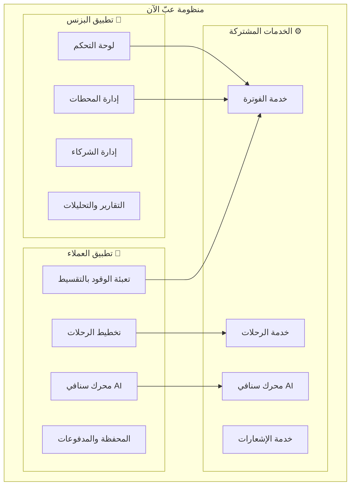

### 1.3 الأهداف الاستراتيجية

| الهدف | الوصف | مؤشر الأداء |
|-------|-------|-------------|
| تسهيل التمويل | توفير تقسيط مرن للوقود | 80% معدل القبول |
| تحسين التجربة | تطبيق سهل الاستخدام | تقييم 4.5+ |
| ذكاء اصطناعي | تنبؤات دقيقة للاستهلاك | دقة 90%+ |
| توسع الشراكات | شبكة محطات واسعة | 500+ محطة |

---

<a name="stakeholders"></a>
## 2. تحليل أصحاب المصلحة (Stakeholders)

### 2.1 مخطط أصحاب المصلحة

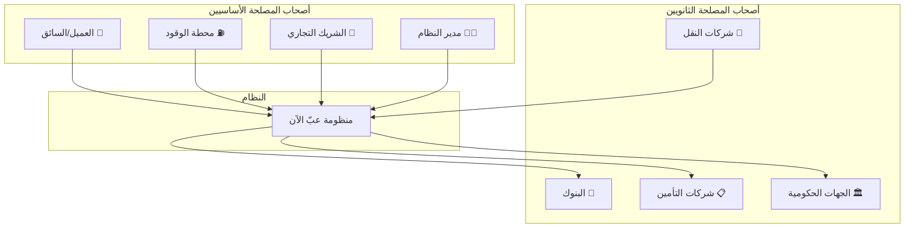

### 2.2 تفاصيل الفاعلين (Actors)

#### تطبيق العملاء 📱

| الفاعل | الوصف | الصلاحيات |
|--------|-------|----------|
| **عميل فردي** | سائق يريد تعبئة وقود بالتقسيط | تعبئة، دفع، تخطيط رحلات |
| **عميل أسطول** | مدير أسطول سيارات | إدارة متعددة، تقارير |
| **ضيف** | مستخدم غير مسجل | استعراض المحطات فقط |

#### تطبيق البزنس 💼

| الفاعل | الوصف | الصلاحيات |
|--------|-------|----------|
| **مالك المحطة** | صاحب محطة وقود | إدارة المحطة، المبيعات |
| **موظف المحطة** | عامل في المحطة | تنفيذ التعبئة |
| **شريك تجاري** | شركة شريكة (تأمين، بنك) | عروض، تمويل |
| **مدير النظام** | مسؤول إداري | كامل الصلاحيات |
| **محاسب** | مسؤول مالي | التقارير المالية |

---

<a name="business-processes"></a>
## 3. نمذجة العمليات التجارية (BPMN)

### 3.1 العملية الرئيسية: طلب تعبئة وقود بالتقسيط

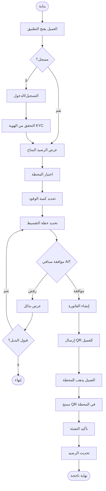

### 3.2 عملية سداد الأقساط

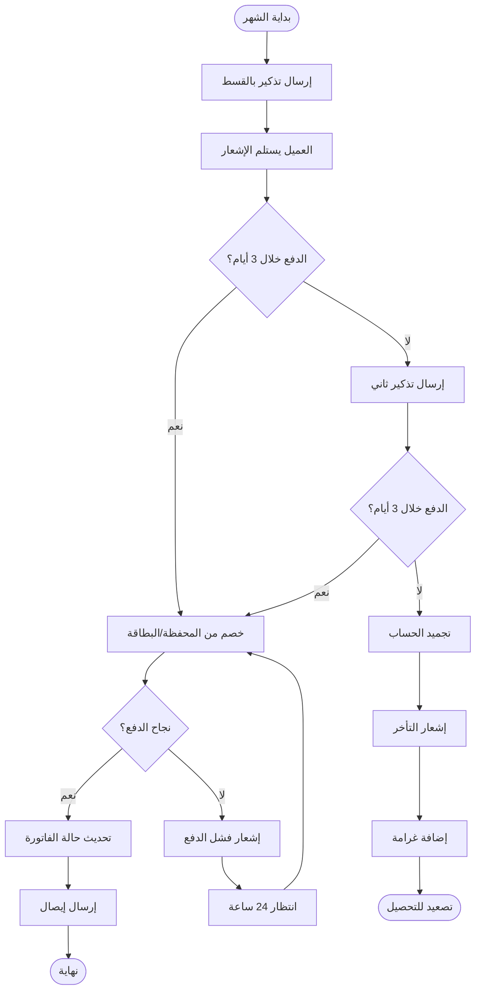

### 3.3 عملية تخطيط الرحلة

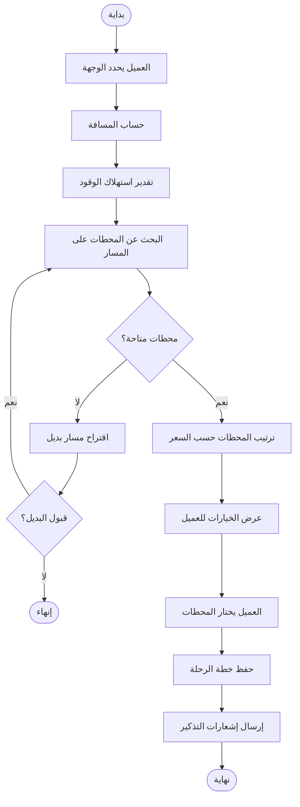

### 3.4 عملية تسجيل محطة جديدة (تطبيق البزنس)

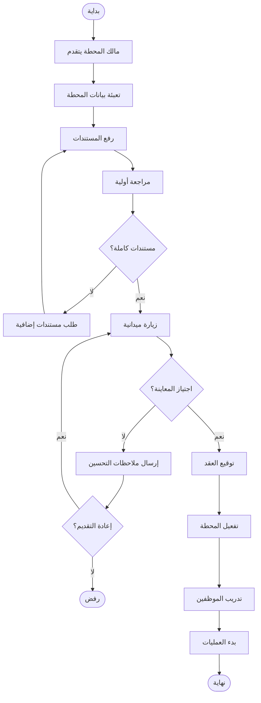

### 3.5 عملية قياس الخزان بالذكاء الاصطناعي (سنافي)

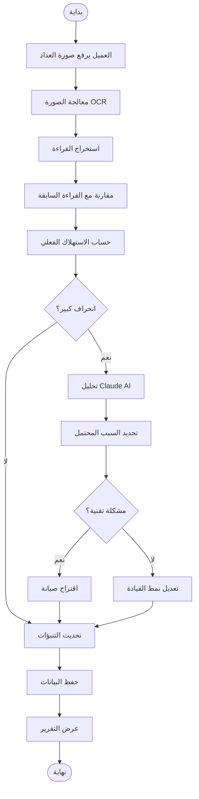

---

<a name="customer-use-cases"></a>
## 4. حالات الاستخدام - تطبيق العملاء

### 4.1 مخطط حالات الاستخدام الشامل

```mermaid
graph TB
    subgraph "تطبيق العملاء"
        subgraph "إدارة الحساب"
            UC1[التسجيل]
            UC2[تسجيل الدخول]
            UC3[تحديث الملف الشخصي]
            UC4[التحقق من الهوية]
            UC5[إضافة مركبة]
        end
        
        subgraph "تعبئة الوقود"
            UC6[طلب تعبئة]
            UC7[اختيار خطة التقسيط]
            UC8[عرض QR التعبئة]
            UC9[تأكيد التعبئة]
            UC10[استعراض الفواتير]
        end
        
        subgraph "المدفوعات"
            UC11[شحن المحفظة]
            UC12[سداد قسط]
            UC13[عرض سجل المدفوعات]
            UC14[ربط بطاقة ائتمان]
        end
        
        subgraph "تخطيط الرحلات"
            UC15[إنشاء رحلة]
            UC16[البحث عن محطات]
            UC17[حساب تكلفة الرحلة]
            UC18[حفظ المسار المفضل]
        end
        
        subgraph "سنافي AI"
            UC19[رفع صورة العداد]
            UC20[عرض تحليل الاستهلاك]
            UC21[الحصول على توصيات]
            UC22[تتبع صحة المركبة]
        end
        
        subgraph "الإشعارات"
            UC23[استلام التذكيرات]
            UC24[عرض العروض]
        end
    end
    
    Customer((العميل)) --> UC1
    Customer --> UC6
    Customer --> UC11
    Customer --> UC15
    Customer --> UC19
    Customer --> UC23
    
    Fleet((مدير الأسطول)) --> UC5
    Fleet --> UC10
    Fleet --> UC13
```

### 4.2 تفاصيل حالات الاستخدام الرئيسية

#### UC6: طلب تعبئة وقود

| البند | التفاصيل |
|-------|----------|
| **الاسم** | طلب تعبئة وقود بالتقسيط |
| **الفاعل** | العميل المسجل |
| **المتطلبات المسبقة** | حساب مفعل، رصيد ائتماني متاح |
| **المتطلبات اللاحقة** | إنشاء فاتورة، توليد QR |
| **السيناريو الرئيسي** | 1. العميل يفتح شاشة التعبئة<br>2. يختار المحطة<br>3. يحدد الكمية/المبلغ<br>4. يختار خطة التقسيط<br>5. يؤكد الطلب<br>6. يستلم QR |
| **السيناريوهات البديلة** | - رصيد غير كافٍ: عرض خيارات الشحن<br>- رفض سنافي: عرض بدائل |
| **قواعد العمل** | - الحد الأقصى للتعبئة: 500 ريال<br>- التقسيط 3-12 شهر |

#### UC19: رفع صورة العداد (سنافي)

| البند | التفاصيل |
|-------|----------|
| **الاسم** | تحليل صورة عداد الوقود |
| **الفاعل** | العميل |
| **المتطلبات المسبقة** | مركبة مسجلة، كاميرا متاحة |
| **المتطلبات اللاحقة** | تسجيل القراءة، تحديث التنبؤات |
| **السيناريو الرئيسي** | 1. العميل يفتح كاميرا سنافي<br>2. يلتقط صورة العداد<br>3. النظام يعالج الصورة<br>4. يعرض القراءة للتأكيد<br>5. يحفظ البيانات<br>6. يعرض التحليل |
| **السيناريوهات البديلة** | - صورة غير واضحة: طلب إعادة التصوير<br>- قراءة غير منطقية: تأكيد يدوي |

---

<a name="business-use-cases"></a>
## 5. حالات الاستخدام - تطبيق البزنس والشركاء

### 5.1 مخطط حالات الاستخدام الشامل

```mermaid
graph TB
    subgraph "تطبيق البزنس والشركاء"
        subgraph "إدارة المحطات"
            BU1[تسجيل محطة جديدة]
            BU2[تحديث بيانات المحطة]
            BU3[إدارة أسعار الوقود]
            BU4[إدارة المخزون]
            BU5[عرض المبيعات]
        end
        
        subgraph "إدارة الموظفين"
            BU6[إضافة موظف]
            BU7[تعيين صلاحيات]
            BU8[تتبع الأداء]
        end
        
        subgraph "العمليات اليومية"
            BU9[مسح QR العميل]
            BU10[تأكيد التعبئة]
            BU11[معالجة الإرجاع]
        end
        
        subgraph "التقارير والتحليلات"
            BU12[تقرير المبيعات]
            BU13[تقرير العمولات]
            BU14[تحليل الأداء]
            BU15[تصدير البيانات]
        end
        
        subgraph "إدارة الشراكات"
            BU16[عرض العقد]
            BU17[طلب تعديل العمولة]
            BU18[التواصل مع الدعم]
        end
        
        subgraph "الإدارة المالية"
            BU19[عرض المستحقات]
            BU20[طلب صرف]
            BU21[عرض الفواتير]
        end
    end
    
    Owner((مالك المحطة)) --> BU1
    Owner --> BU3
    Owner --> BU12
    Owner --> BU19
    
    Employee((موظف المحطة)) --> BU9
    Employee --> BU10
    
    Partner((الشريك التجاري)) --> BU16
    Partner --> BU17
    
    Admin((مدير النظام)) --> BU6
    Admin --> BU14
    Admin --> BU15
    
    Accountant((المحاسب)) --> BU13
    Accountant --> BU20
    Accountant --> BU21
```

### 5.2 تفاصيل حالات الاستخدام الرئيسية

#### BU9: مسح QR العميل

| البند | التفاصيل |
|-------|----------|
| **الاسم** | مسح رمز QR لتعبئة الوقود |
| **الفاعل** | موظف المحطة |
| **المتطلبات المسبقة** | تسجيل دخول الموظف، طلب تعبئة صالح |
| **المتطلبات اللاحقة** | تسجيل التعبئة، تحديث المخزون |
| **السيناريو الرئيسي** | 1. الموظف يفتح الماسح<br>2. يمسح QR العميل<br>3. يتحقق من الكمية<br>4. يبدأ التعبئة<br>5. يؤكد الانتهاء<br>6. يطبع الإيصال |
| **السيناريوهات البديلة** | - QR منتهي: رفض مع رسالة<br>- مبلغ يتجاوز الحد: تعديل الكمية |

#### BU12: تقرير المبيعات

| البند | التفاصيل |
|-------|----------|
| **الاسم** | عرض تقرير مبيعات المحطة |
| **الفاعل** | مالك المحطة، المحاسب |
| **المتطلبات المسبقة** | صلاحيات العرض |
| **السيناريو الرئيسي** | 1. المستخدم يحدد الفترة<br>2. يختار نوع التقرير<br>3. النظام يجمع البيانات<br>4. يعرض الرسوم البيانية<br>5. خيار التصدير PDF/Excel |

---

<a name="database-design"></a>
## 6. تصميم قاعدة البيانات الشاملة

### 6.1 مخطط علاقات الكيانات (ERD)

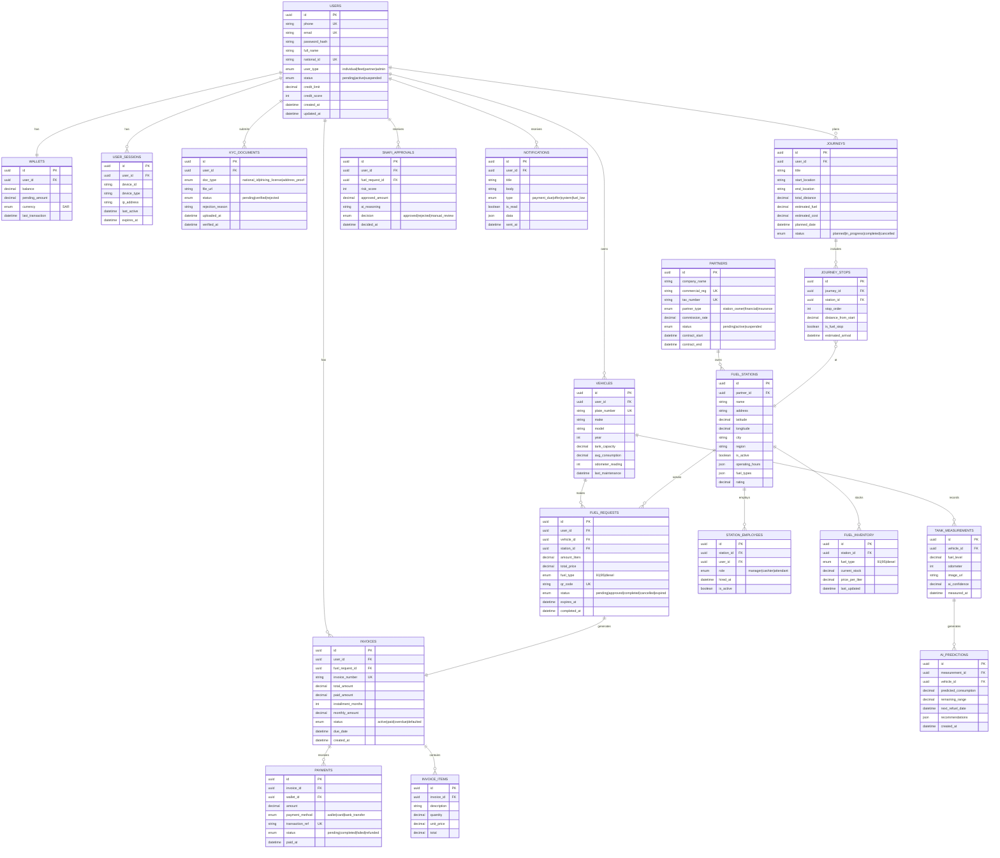

### 6.2 قاموس البيانات

#### جدول المستخدمين (USERS)

| الحقل | النوع | القيود | الوصف |
|-------|-------|--------|-------|
| id | UUID | PK | معرف فريد |
| phone | VARCHAR(15) | UNIQUE, NOT NULL | رقم الجوال |
| email | VARCHAR(100) | UNIQUE | البريد الإلكتروني |
| password_hash | VARCHAR(255) | NOT NULL | كلمة المرور المشفرة |
| full_name | VARCHAR(100) | NOT NULL | الاسم الكامل |
| national_id | VARCHAR(10) | UNIQUE | رقم الهوية |
| user_type | ENUM | NOT NULL | نوع المستخدم |
| status | ENUM | DEFAULT 'pending' | حالة الحساب |
| credit_limit | DECIMAL(10,2) | DEFAULT 0 | الحد الائتماني |
| credit_score | INT | DEFAULT 500 | درجة الائتمان |

#### جدول الفواتير (INVOICES)

| الحقل | النوع | القيود | الوصف |
|-------|-------|--------|-------|
| id | UUID | PK | معرف فريد |
| user_id | UUID | FK → USERS | العميل |
| invoice_number | VARCHAR(20) | UNIQUE | رقم الفاتورة |
| total_amount | DECIMAL(10,2) | NOT NULL | المبلغ الإجمالي |
| paid_amount | DECIMAL(10,2) | DEFAULT 0 | المبلغ المدفوع |
| installment_months | INT | CHECK 1-12 | عدد الأقساط |
| monthly_amount | DECIMAL(10,2) | | القسط الشهري |
| status | ENUM | DEFAULT 'active' | حالة الفاتورة |

---

<a name="sequence-diagrams"></a>
## 7. مخططات التسلسل (Sequence Diagrams)

### 7.1 تسلسل عملية التعبئة الكاملة

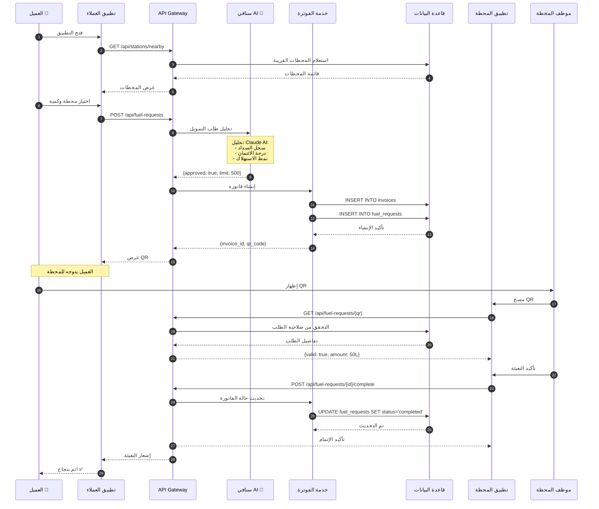

### 7.2 تسلسل تحليل سنافي AI

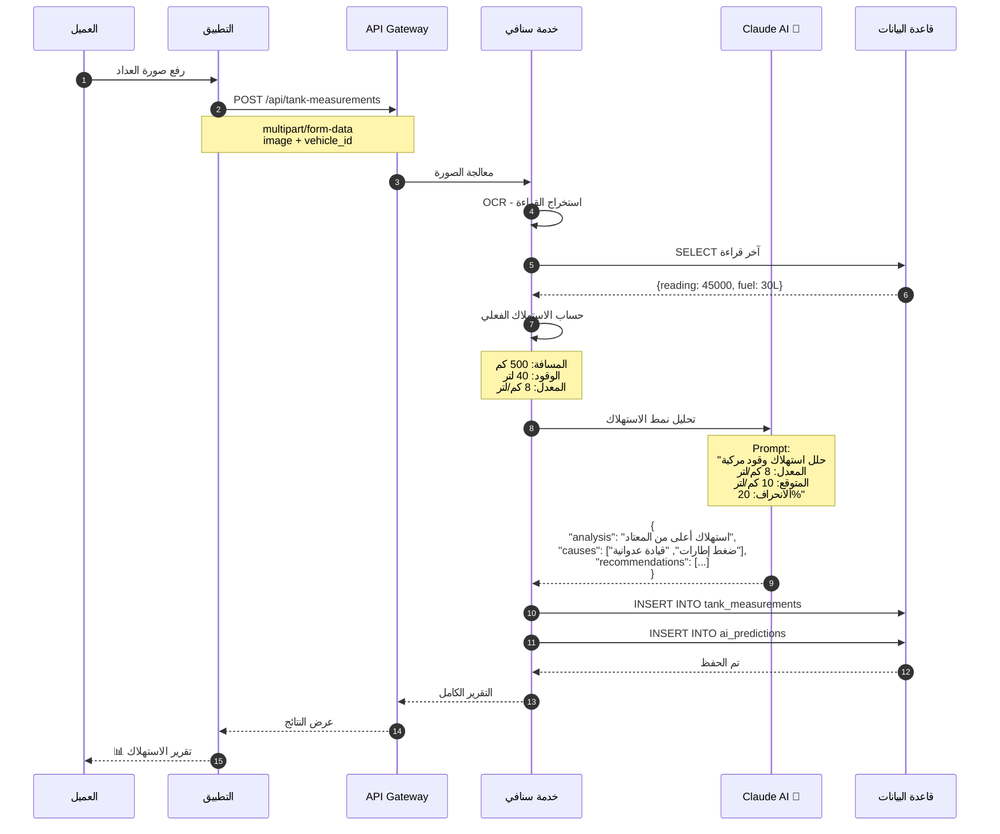

### 7.3 تسلسل تسجيل محطة جديدة

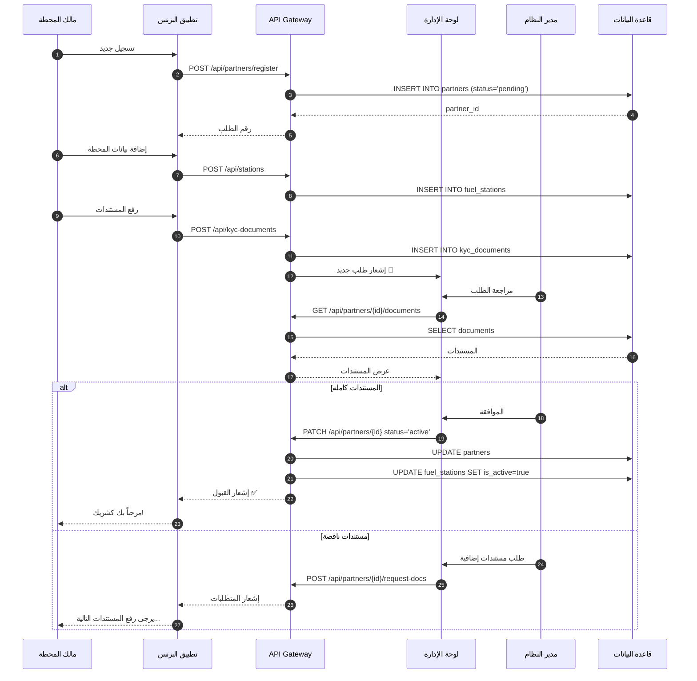

---

<a name="api-design"></a>
## 8. تصميم واجهات API

### 8.1 هيكل API لتطبيق العملاء

#### المصادقة والحسابات

| Method | Endpoint | الوصف | المدخلات | المخرجات |
|--------|----------|-------|----------|----------|
| POST | /api/auth/register | تسجيل جديد | phone, password, name | user, token |
| POST | /api/auth/login | تسجيل الدخول | phone, password | user, token |
| POST | /api/auth/verify-otp | تأكيد OTP | phone, otp | success |
| GET | /api/users/me | الملف الشخصي | - | user details |
| PATCH | /api/users/me | تحديث الملف | fields to update | updated user |

#### المركبات

| Method | Endpoint | الوصف | المدخلات | المخرجات |
|--------|----------|-------|----------|----------|
| GET | /api/vehicles | قائمة المركبات | - | vehicles[] |
| POST | /api/vehicles | إضافة مركبة | plate, make, model | vehicle |
| GET | /api/vehicles/:id | تفاصيل المركبة | - | vehicle |
| DELETE | /api/vehicles/:id | حذف مركبة | - | success |

#### طلبات الوقود

| Method | Endpoint | الوصف | المدخلات | المخرجات |
|--------|----------|-------|----------|----------|
| POST | /api/fuel-requests | طلب تعبئة | station_id, amount, vehicle_id | request, qr_code |
| GET | /api/fuel-requests | قائمة الطلبات | status?, page? | requests[] |
| GET | /api/fuel-requests/:id | تفاصيل الطلب | - | request |
| POST | /api/fuel-requests/:id/cancel | إلغاء الطلب | - | success |

#### الفواتير والمدفوعات

| Method | Endpoint | الوصف | المدخلات | المخرجات |
|--------|----------|-------|----------|----------|
| GET | /api/invoices | قائمة الفواتير | status?, page? | invoices[] |
| GET | /api/invoices/:id | تفاصيل الفاتورة | - | invoice, payments |
| POST | /api/invoices/:id/pay | سداد قسط | amount, method | payment |
| GET | /api/wallet | رصيد المحفظة | - | balance |
| POST | /api/wallet/topup | شحن المحفظة | amount, method | transaction |

#### الرحلات

| Method | Endpoint | الوصف | المدخلات | المخرجات |
|--------|----------|-------|----------|----------|
| POST | /api/journeys | إنشاء رحلة | start, end, vehicle_id | journey, stops |
| GET | /api/journeys | قائمة الرحلات | - | journeys[] |
| GET | /api/journeys/:id | تفاصيل الرحلة | - | journey, stops |
| DELETE | /api/journeys/:id | حذف الرحلة | - | success |

#### سنافي AI

| Method | Endpoint | الوصف | المدخلات | المخرجات |
|--------|----------|-------|----------|----------|
| POST | /api/tank-measurements | رفع قراءة | image, vehicle_id | measurement, prediction |
| GET | /api/tank-measurements | سجل القراءات | vehicle_id | measurements[] |
| GET | /api/predictions | التنبؤات | vehicle_id | predictions[] |
| POST | /api/snafi/analyze | تحليل شامل | vehicle_id | analysis, recommendations |

### 8.2 هيكل API لتطبيق البزنس

#### إدارة المحطات

| Method | Endpoint | الوصف | المدخلات | المخرجات |
|--------|----------|-------|----------|----------|
| POST | /api/business/stations | تسجيل محطة | station data | station |
| GET | /api/business/stations | محطاتي | - | stations[] |
| PATCH | /api/business/stations/:id | تحديث المحطة | fields | station |
| GET | /api/business/stations/:id/sales | مبيعات المحطة | from, to | sales report |

#### العمليات

| Method | Endpoint | الوصف | المدخلات | المخرجات |
|--------|----------|-------|----------|----------|
| GET | /api/business/fuel-requests/scan/:qr | مسح QR | - | request details |
| POST | /api/business/fuel-requests/:id/complete | تأكيد التعبئة | actual_amount | success |
| GET | /api/business/transactions | المعاملات | date_range | transactions[] |

#### التقارير

| Method | Endpoint | الوصف | المدخلات | المخرجات |
|--------|----------|-------|----------|----------|
| GET | /api/business/reports/sales | تقرير المبيعات | period | sales data |
| GET | /api/business/reports/commission | تقرير العمولات | period | commission data |
| GET | /api/business/reports/export | تصدير التقارير | type, format | file URL |

#### إدارة الموظفين

| Method | Endpoint | الوصف | المدخلات | المخرجات |
|--------|----------|-------|----------|----------|
| GET | /api/business/employees | قائمة الموظفين | station_id | employees[] |
| POST | /api/business/employees | إضافة موظف | user_id, role | employee |
| PATCH | /api/business/employees/:id | تحديث صلاحيات | role | employee |
| DELETE | /api/business/employees/:id | إزالة موظف | - | success |

### 8.3 نموذج الاستجابة الموحد

```json
{
  "success": true,
  "data": { ... },
  "meta": {
    "page": 1,
    "per_page": 20,
    "total": 100,
    "total_pages": 5
  },
  "message": "تم بنجاح"
}
```

```json
{
  "success": false,
  "error": {
    "code": "INSUFFICIENT_BALANCE",
    "message": "الرصيد غير كافٍ",
    "details": {
      "required": 500,
      "available": 200
    }
  }
}
```

---

<a name="state-diagrams"></a>
## 9. مخططات الحالة (State Diagrams)

### 9.1 حالات طلب التعبئة

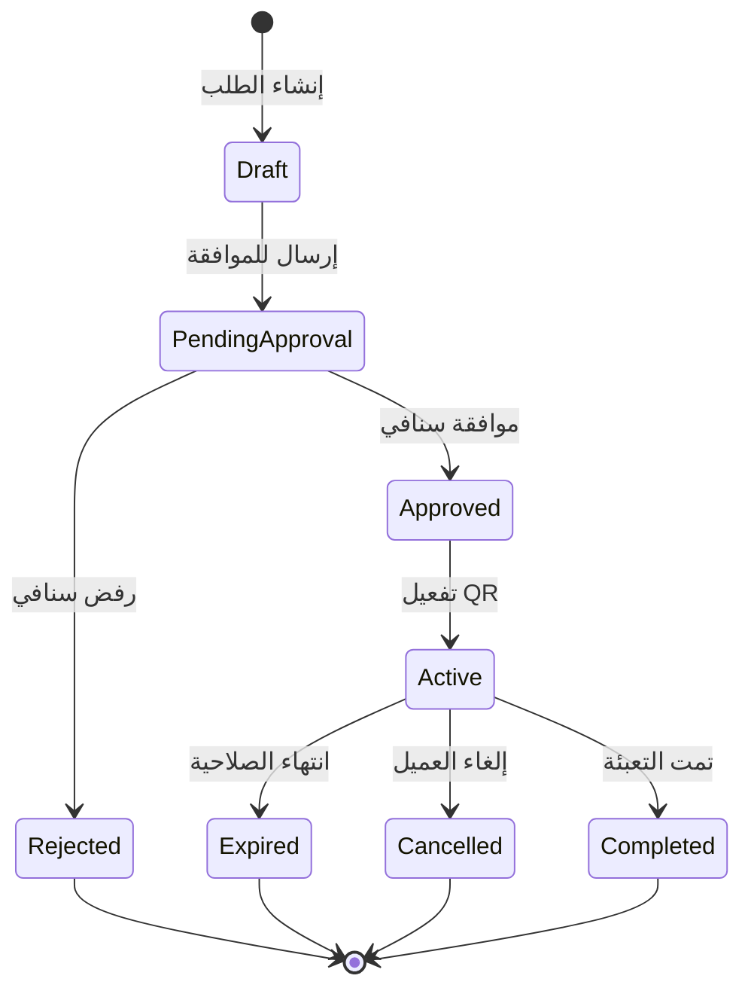

### 9.2 حالات الفاتورة

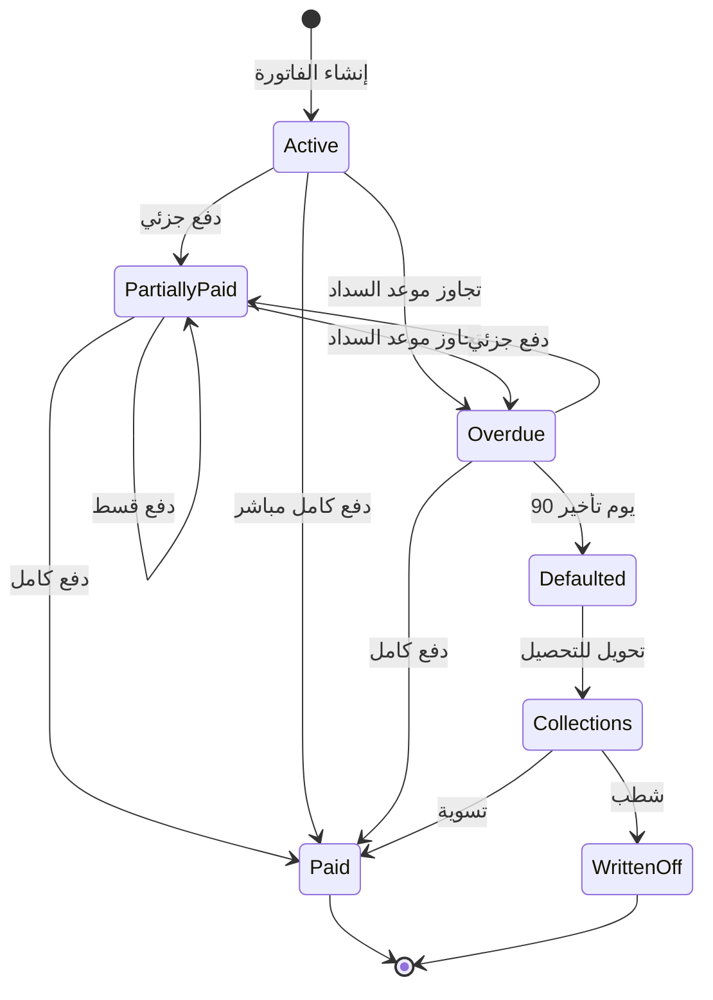

### 9.3 حالات حساب المستخدم

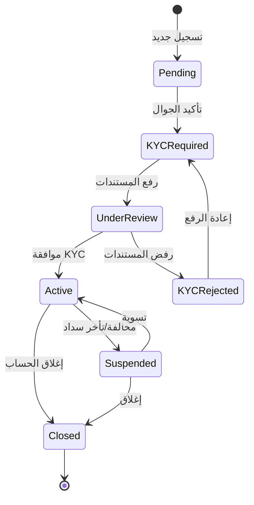

### 9.4 حالات المحطة

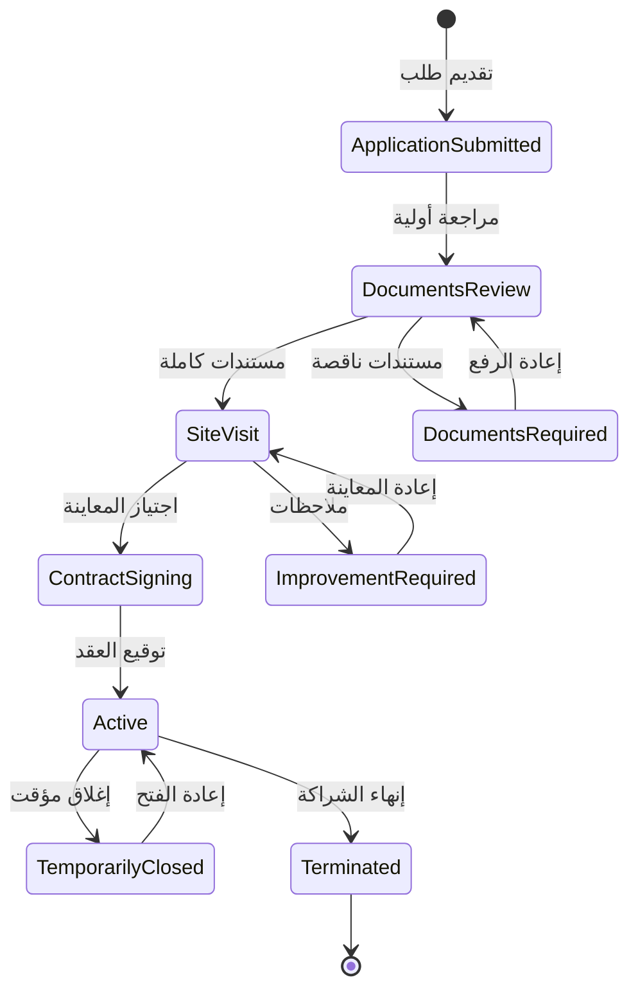

---

## 10. ملخص التصميم

### المكونات الأساسية

| المكون | الوصف | التقنيات |
|--------|-------|----------|
| تطبيق العملاء | تطبيق جوال للعملاء | React Native / Flutter |
| تطبيق البزنس | تطبيق ويب للشركاء | React + TypeScript |
| API Gateway | نقطة الدخول الموحدة | Express.js |
| خدمة الفوترة | إدارة الفواتير والمدفوعات | Node.js + PostgreSQL |
| خدمة الرحلات | تخطيط المسارات | Node.js + Maps API |
| محرك سنافي | الذكاء الاصطناعي | Claude AI + OCR |
| قاعدة البيانات | التخزين الدائم | PostgreSQL |

### عدد الكيانات
- **18 جدول** في قاعدة البيانات
- **5 مخططات BPMN** للعمليات
- **45+ حالة استخدام** موزعة على التطبيقين
- **60+ نقطة API** موثقة

---

*تم إنشاء هذه الوثيقة باستخدام Claude AI لنظام عبّ الآن*
*آخر تحديث: فبراير 2026*
